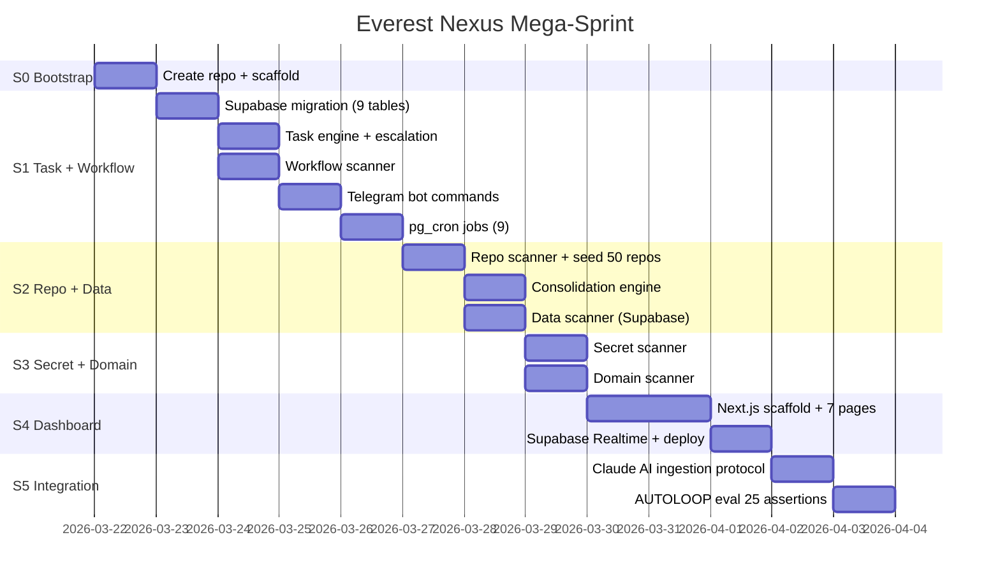

# Everest Nexus — Sprint Plan
## Mega-Sprint: 5 Claude Code Sessions

**Spec:** EVEREST-NEXUS-SPEC.md
**Repo:** breverdbidder/everest-nexus (NEW)
**Dashboard:** nexus.zonewise.ai (Vercel Pro)
**Build Order:** Task → Workflow → Repo → Data → Secret → Domain

---

## Session Map



---

## S0 — Bootstrap (Execute from Claude AI now)

```yaml
tasks:
  S0.1: Create repo breverdbidder/everest-nexus via GitHub API
  S0.2: Push scaffold (README, .gitignore, package.json, CLAUDE.md, dirs)
  S0.3: Push EVEREST-NEXUS-SPEC.md + EVEREST-NEXUS-PLAN.md to docs/
  S0.4: Create Summit workflow for S1
  S0.5: Dispatch S1 to Hetzner
  S0.6: Ariel adds nexus.zonewise.ai CNAME in Cloudflare + creates Vercel project
```

---

## S1 — Task Intelligence + Workflow Intelligence (~60 min)

### S1.1 Supabase Migration
```yaml
file: supabase/migrations/001_nexus_foundation.sql
tables: nexus_tasks, nexus_workflows, nexus_repos, nexus_tables,
        nexus_secrets, nexus_domains, nexus_notifications,
        nexus_chat_sessions, nexus_insights
rls: anon SELECT, service_role ALL
realtime: nexus_tasks, nexus_notifications
indexes: per spec
run: Supabase REST API
```

### S1.2 Task Engine
```yaml
files:
  scanners/task_engine.py:
    - create_task, update_status, auto_assign_priority
    - compute_sla_deadline, get_active, get_stale
  scanners/escalation.py:
    - check_p0_escalation (2hr repeat)
    - send_accountability (4hr)
    - build_digest (9AM/5PM)
  scanners/notifier.py:
    - send_telegram, format_task_list
    - route_by_priority (P0=instant, P1=instant, P2=digest, P3=silent)
tests: 20 assertions
```

### S1.3 Workflow Scanner
```yaml
files:
  scanners/workflow_scanner.py:
    - scan_all_repos, fetch_runs, compute_health
    - detect_dead_workflows, estimate_cost
    - generate_recommendations → nexus_insights
  scanners/seed_workflows.py:
    - Initial full scan of 50 repos
tests: 10 assertions
```

### S1.4 Telegram Commands
```yaml
file: scanners/telegram_commands.py
commands: /tasks /p0 /p1 /stale /bump /demote /done /skip /block /digest /nexus
wire_to: bot_v4.py in claude-code-telegram-control
```

### S1.5 pg_cron Jobs
```yaml
file: supabase/migrations/002_cron_jobs.sql
jobs:
  nexus_staleness: "*/5 * * * *"
  nexus_p0_escalation: "0 */2 * * *"
  nexus_morning_digest: "0 14 * * *"
  nexus_evening_digest: "0 22 * * *"
  nexus_workflow_scan: "0 */6 * * *"
  nexus_repo_scan: "0 */6 * * *"
  nexus_data_scan: "0 */12 * * *"
  nexus_secret_scan: "0 6 * * *"
  nexus_domain_scan: "0 7 * * *"
```

---

## S2 — Repo Intelligence + Data Intelligence (~45 min)

### S2.1 Repo Scanner + Seed
```yaml
files:
  scanners/repo_scanner.py:
    - fetch_all_repos (paginate GitHub API)
    - classify_tier (core/active/monitored per spec)
    - compute_health_score (0-100 formula)
    - scan_ci_status
  scanners/seed_repos.py:
    - Initial seed: 50 repos with correct tiers
verify: SELECT count(*) FROM nexus_repos = 50
```

### S2.2 Consolidation Engine
```yaml
file: scanners/consolidation.py
functions:
  - detect_families (by name prefix)
  - generate_recommendations → nexus_insights
  - archive_repo (GitHub API PATCH archived=true)
seeds:
  - zonewise-family: 9 repos → keep 3, archive 4, merge 2
  - biddeed-family: 5 repos → keep 2, archive 2, merge 1
  - infra-family: 4 repos → keep 2, archive 2
```

### S2.3 Data Scanner
```yaml
file: scanners/data_scanner.py
functions:
  - fetch_all_tables (information_schema)
  - compute_sizes (pg_total_relation_size)
  - detect_orphans (0 rows + no FK + no inserts 30d)
  - detect_missing_rls
  - assign_project (by table prefix)
```

---

## S3 — Secret + Domain Intelligence (~30 min)

### S3.1 Secret Scanner
```yaml
file: scanners/secret_scanner.py
- fetch_all_secrets (GitHub API per repo)
- cross_reference (shared across repos)
- detect_stale (>365 days no update)
- flag_known_dead (PAT1-3)
```

### S3.2 Domain Scanner
```yaml
file: scanners/domain_scanner.py
- check_ssl, check_dns, check_http
- seed: biddeed.ai, zonewise.ai, nexus.zonewise.ai, watch.biddeed.ai
```

---

## S4 — Dashboard (~60 min)

### S4.1 Next.js App
```yaml
framework: Next.js 14 App Router + Tailwind + Supabase JS
brand: Navy #1E3A5F, Orange #F59E0B, bg #020617, Inter
pages:
  /: Overview (HealthRing + PriorityStrip + RecentActivity)
  /tasks: TaskTable + InlineActions + SLATimers
  /workflows: WorkflowGrid + DeadPanel + CostEstimator
  /repos: RepoCards + ConsolidationPanel + ArchiveButton
  /data: TableGrid + OrphanPanel + SchemaViewer
  /secrets: SecretMatrix + ExpiryTimeline
  /domains: DomainList + SSLCountdown
  layout: Sidebar nav + house brand
realtime: Subscribe to nexus_tasks + nexus_notifications
auth: Vercel deployment protection
```

---

## S5 — Integration + Eval (~20 min)

### S5.1 Claude AI Ingestion
```yaml
file: scanners/ingest.py
exports: Shell commands for bash_tool to call during chat
  push_task(task_dict) → POST nexus_tasks
  push_session(session_dict) → POST nexus_chat_sessions
  push_batch(tasks) → bulk upsert
```

### S5.2 AUTOLOOP Eval
```yaml
file: eval/eval.json (25 assertions)
categories:
  migration: 5 (tables exist, columns correct)
  task_engine: 5 (priority rules, escalation)
  scanners: 5 (repos=50, workflows detected, secrets found)
  dashboard: 5 (pages render, realtime connects)
  telegram: 5 (commands respond correctly)
```

---

## Commit Rules

```yaml
git:
  email: ci@biddeed.ai
  name: BidDeed-CI
  prefix: "NEXUS:"
  push: main after each logical unit
  telegram: Notify per sprint completion
```

---

## Success Criteria

```yaml
done:
  - 9 Supabase tables created (nexus_ prefix)
  - 50 repos in nexus_repos with correct tiers
  - All GHA workflows scanned into nexus_workflows
  - P0 escalation fires every 2hr (verified)
  - Digest sends 9AM + 5PM EST
  - Telegram commands operational
  - nexus.zonewise.ai live with all 7 pages
  - Realtime updates flowing
  - Consolidation recommendations generated
  - AUTOLOOP eval >= 80%
```
